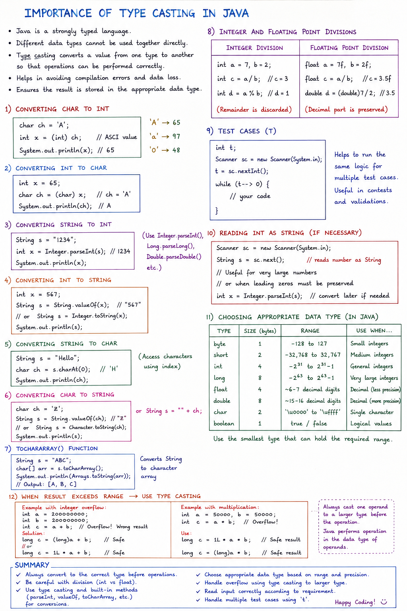
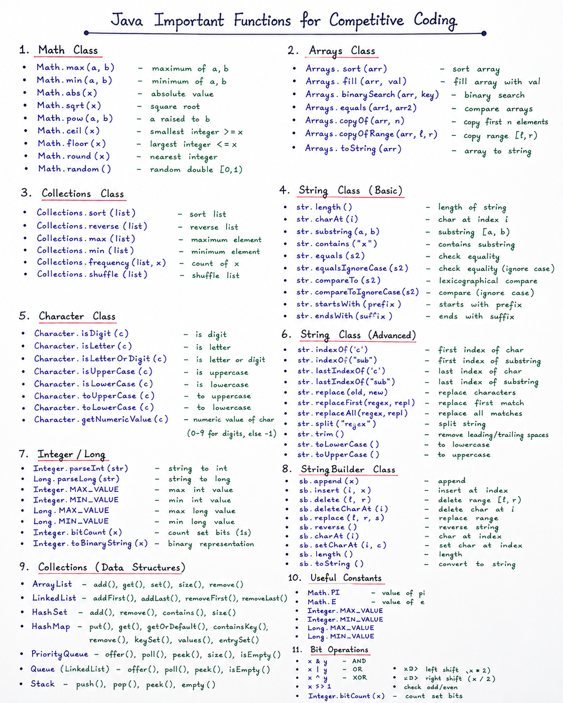
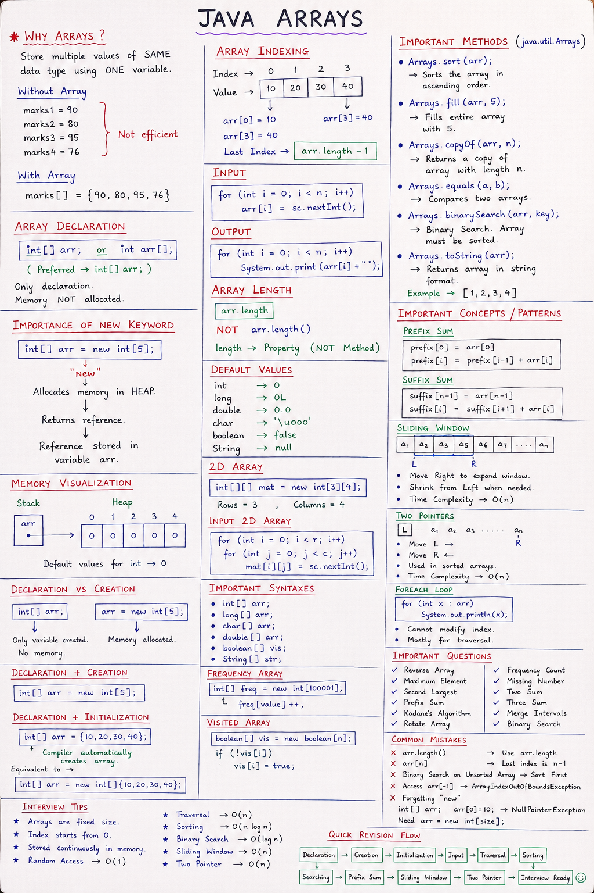

<h2 style="display:inline;">📚 Data Types, Conditional Stmts, Operators and Loops</h2>

Data types are important because they determine what kind of data you can store, how much memory it uses, and what range of values it can handle.

For competitive coding, choosing the correct data type helps you:

<ul style="margin-top:0; margin-bottom:12px; padding-left:20px;">
  <li style="margin-bottom:4px;">⚡ <strong>Avoid overflow</strong> — e.g., use <code>long</code> for very large numbers.</li>
  <li style="margin-bottom:4px;">💾 <strong>Manage memory efficiently</strong> — important for large arrays.</li>
  <li style="margin-bottom:4px;">🎯 <strong>Get correct results</strong> — especially in integer division and arithmetic.</li>
  <li style="margin-bottom:4px;">🧩 <strong>Match problem constraints</strong> — choose based on the maximum possible input value.</li>
</ul>

<strong>Example:</strong> If a problem says <em>n ≤ 10⁹</em>, <code>int</code> may be enough, but calculations like <em>n × n</em> can reach <em>10¹⁸</em>, so <code>long</code> is safer.

👉 <strong>Rule:</strong> In competitive coding, always check constraints before choosing a data type.

<h3>Reference Diagram <em>(Click image to view/download full resolution)</em></h3>

<h2 style="display:inline;">📚 Typecasting & Data Conversions</h2>

 

In Java, <strong>Typecasting</strong> is the process of converting a value from one data type to another. Mastering both <strong>Implicit (Widening)</strong> and <strong>Explicit (Narrowing)</strong> conversions is essential for mathematical accuracy, preventing hidden logic bugs, and avoiding runtime errors.

<h3>Why Data Conversions Matter in Competitive Coding & Math</h3>
<ul>
  <li>
    <strong>Preventing Loss of Precision in Integer Division:</strong> 
    In Java, dividing two integers always yields an integer (e.g., <code>5 / 2</code> evaluates to <code>2</code>, not <code>2.5</code>). In competitive programming math problems (like computing averages or probabilities), failing to cast at least one operand to <code>double</code> (e.g., <code>(double) 5 / 2</code>) causes truncation errors.
  </li>
  <li>
    <strong>Avoiding Intermediate Overflow During Arithmetic:</strong> 
    When multiplying two large <code>int</code> values, the result is calculated as an <code>int</code> <em>before</em> being assigned to a destination variable. If the product exceeds 2 × 10⁹, it silently overflows into a negative value—even if assigned to a <code>long</code>.
    <ul>
      <li>❌ <strong>Incorrect:</strong> <code>long total = a * b;</code> <em>(overflow occurs during multiplication)</em></li>
      <li>✅ <strong>Correct:</strong> <code>long total = (long) a * b;</code> <em>(forces 64-bit precision)</em></li>
    </ul>
  </li>
  <li>
    <strong>Safe Downcasting & Range Truncation:</strong> 
    Explicitly casting a larger type to a smaller type (e.g., <code>long</code> to <code>int</code>) clips high-order bits via modulo arithmetic. While useful in bitwise optimizations, unintended narrowing leads to unexpected negative numbers.
  </li>
</ul>
<h3>Reference Diagram <em>(Click image to view/download full resolution)</em></h3>
<a href="./images/typecasting.png" target="_blank">
  
</a>

---

<h2 style="display:inline;">📚 Java Important Library Functions (Math, Strings, Arrays & Collections)</h2>

 

Java library functions provide pre-built, optimized methods for common tasks, allowing you to solve problems faster and write cleaner code.

<ul>
  <li>⚡ <strong>Save Time</strong> — Avoid implementing common operations from scratch.</li>
  <li>🧩 <strong>Simplify Code</strong> — Functions like <code>sort()</code>, <code>max()</code>, <code>min()</code>, and <code>binarySearch()</code> reduce complexity.</li>
  <li>🚀 <strong>Improve Efficiency</strong> — Built-in library methods are well-tested and highly optimized.</li>
  <li>🛠️ <strong>Reduce Bugs</strong> — Using reliable built-in methods minimizes implementation errors.</li>
  <li>📚 <strong>Useful Data Structures</strong> — Includes <code>Math</code>, <code>String</code>, <code>Character</code>, <code>Arrays</code>, <code>ArrayList</code>, <code>HashMap</code>, <code>HashSet</code>, etc.</li>
  <li>🎯 <strong>Competitive Advantage</strong> — Allows you to focus on core algorithms rather than low-level implementations.</li>
</ul>

👉 <strong>Rule:</strong> In competitive coding, know commonly used Java library functions and their asymptotic time complexities.

<h3>Reference Diagram <em>(Click image to view/download full resolution)</em></h3>

<a href="./images/JavaLibraryFunctions.png" target="_blank">
  
</a>

---

<h2 style="display:inline;">📚 Java Arrays</h2>

 

Arrays are one of the most fundamental data structures in competitive coding. They allow you to store and efficiently access multiple values using an index.

  
<ul>
  <li>⚡ <strong>Fast Access</strong> — Elements can be accessed directly using an index in <code>O(1)</code> time.</li>
  <li>💾 <strong>Efficient Storage</strong> — Stores multiple values of the same data type in contiguous memory locations.</li>
  <li>🔄 <strong>Easy Traversal</strong> — Ideal for processing sequential data using standard loops.</li>
  <li>🧩 <strong>Foundation for Algorithms</strong> — Search, sort, prefix sums, and two pointers rely heavily on arrays.</li>
  <li>🚀 <strong>Better Performance</strong> — Arrays provide predictable memory layout and fast cache access.</li>
  <li>🎯 <strong>Versatile Application</strong> — Commonly used for strings, matrices, frequency counting, and dynamic programming.</li>
</ul>

👉 <strong>Rule:</strong> In competitive coding, master array indexing, traversal, searching, sorting, and common multi-pointer techniques thoroughly.

 
<h3>Reference Diagram <em>(Click image to view/download full resolution)</em></h3>

---

<a href="./images/JavaArray.png" target="_blank">
  
</a>

