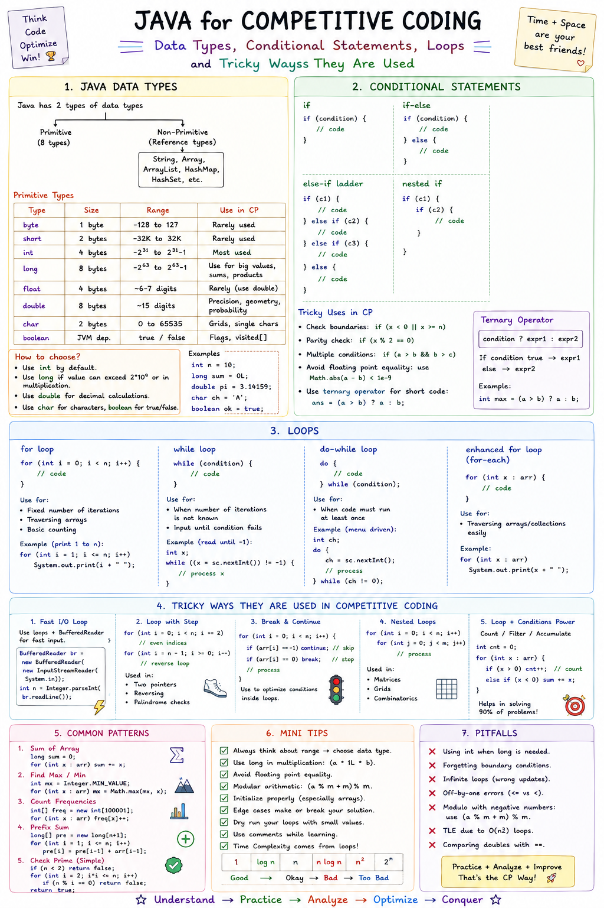

  
<h2>Data Types Knowledge</h2>

In Java, selecting the right data type is a core skill for writing efficient and correct code. This becomes critical in **competitive coding** and **mathematical computations**, where performance limits and precise numerical boundaries determine whether your solution gets accepted.

### Why Data Types Matter in Competitive Coding & Math

* **Preventing Integer Overflow:**
  Standard integer types like `int` can only store values up to $2 \times 10^9$ ($2^{31}-1$). In competitive programming, intermediate calculations (such as factorials, array sums, or matrix multiplications) frequently exceed this limit. Failing to switch to `long` (up to $9 \times 10^{18}$) or `BigInteger` causes silent overflow, resulting in incorrect negative numbers and failed test cases.
* **Precision in Floating-Point Math:**
  Using `float` only provides ~6-7 decimal digits of precision, which leads to rounding errors in high-precision math problems. Using `double` provides 15-17 decimal digits. For financial or exact mathematical modeling, standard floating-point types fail entirely due to binary representation limits, requiring `BigDecimal` to prevent precision loss.
### Reference Diagram

